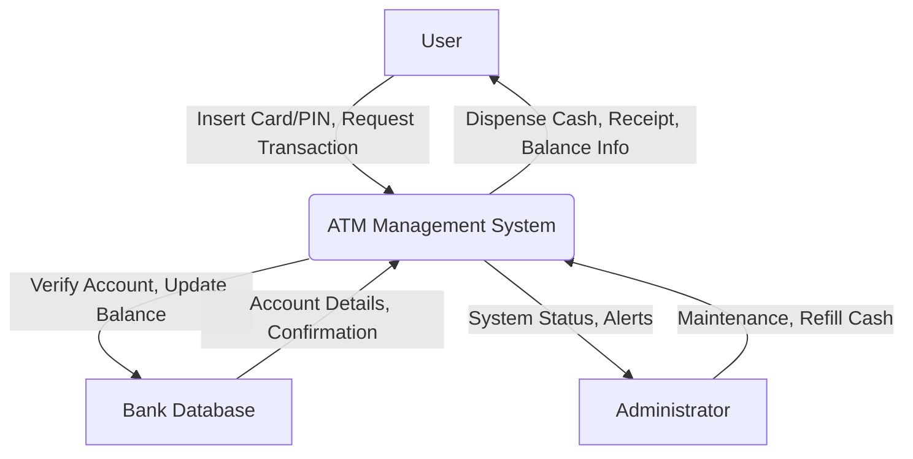

# ATM Management System - DFD Level 0 (Context Diagram)

The Level 0 DFD represents the entire ATM Management System as a single process interacting with external entities.

```mermaid
graph TD
    User[User] -->|Insert Card/PIN, Request Transaction| ATM(ATM Management System)
    ATM -->|Dispense Cash, Receipt, Balance Info| User
    
    ATM -->|Verify Account, Update Balance| BankDB[Bank Database]
    BankDB -->|Account Details, Confirmation| ATM
    
    Admin[Administrator] -->|Maintenance, Refill Cash| ATM
    ATM -->|System Status, Alerts| Admin
```
