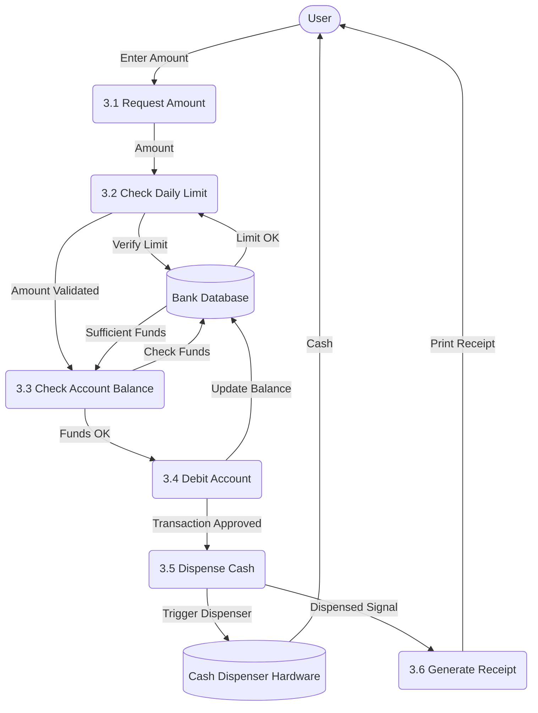

# ATM Management System - DFD Level 2 (Withdraw Cash Process)

The Level 2 DFD provides a detailed breakdown of the "Withdraw Cash" process (Process 3.0 from Level 1).

```mermaid
graph TD
    User([User])
    BankDB[(Bank Database)]
    CashDispenser[(Cash Dispenser Hardware)]
    
    P3_1(3.1 Request Amount)
    P3_2(3.2 Check Daily Limit)
    P3_3(3.3 Check Account Balance)
    P3_4(3.4 Debit Account)
    P3_5(3.5 Dispense Cash)
    P3_6(3.6 Generate Receipt)
    
    User -->|Enter Amount| P3_1
    P3_1 -->|Amount| P3_2
    
    P3_2 -->|Verify Limit| BankDB
    BankDB -->|Limit OK| P3_2
    P3_2 -->|Amount Validated| P3_3
    
    P3_3 -->|Check Funds| BankDB
    BankDB -->|Sufficient Funds| P3_3
    P3_3 -->|Funds OK| P3_4
    
    P3_4 -->|Update Balance| BankDB
    P3_4 -->|Transaction Approved| P3_5
    
    P3_5 -->|Trigger Dispenser| CashDispenser
    CashDispenser -->|Cash| User
    P3_5 -->|Dispensed Signal| P3_6
    
    P3_6 -->|Print Receipt| User
```
